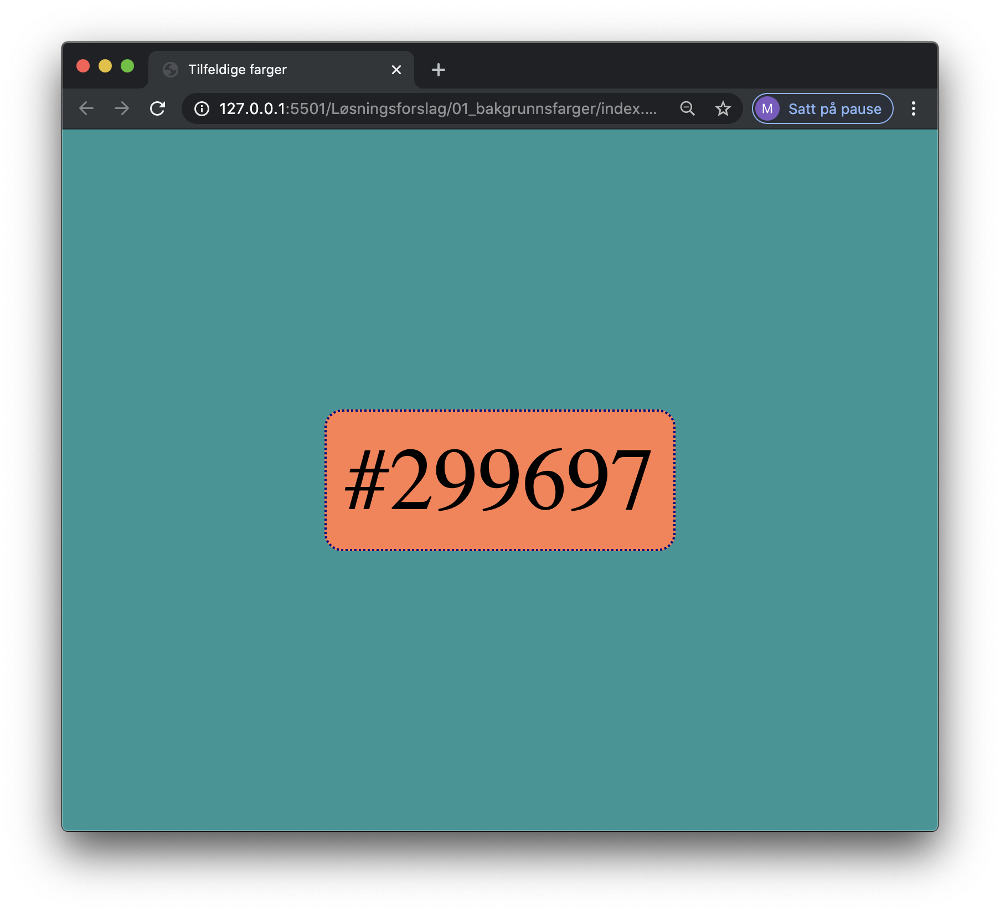
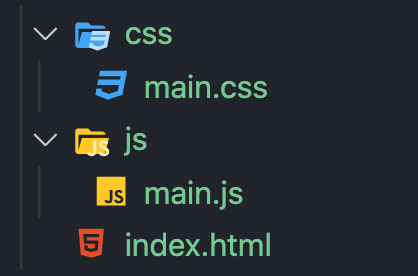

# Miniprosjekt 1

---

## Tilfeldig bakrunnsfarge

Lag en et program som bytter baggrunn til en tilfeldig ny farge når du trykker på space.



Bruk følgende filstruktur:


Javascript

```JavaScript
window.addEventListener("keydown", (e) => {
  // Lag en variabel, fargekode, som skal brukes til å
  // lagre fargekode-strengen

  if (e.code === "Space") { //Prøv med andre taster også
    // Lag en løkke som genererer et tilfeldig tall fra 0-9
    // og legg det til variabelen

    // document.querySelector("id-en-her")
    // .style.backgroundColor = faergekode med # først;

    //Skriv fargekoden til boksen i midten av siden.
  }
});
```

HTML

```html
<div id="hoved">
  <div id="boks">#000000</div>
</div>

<script src="js/main.js"></script>
```

CSS

```css
body {
  margin: 0;
}
#hoved {
  background-color: #000000;
  height: 100vh;
  display: grid;
  place-items: center;
}
#boks {
  background-color: coral;
  font-size: 100px;
  padding: 20px;
  border: 3px solid navy;
  border-radius: 20px;
}
```
